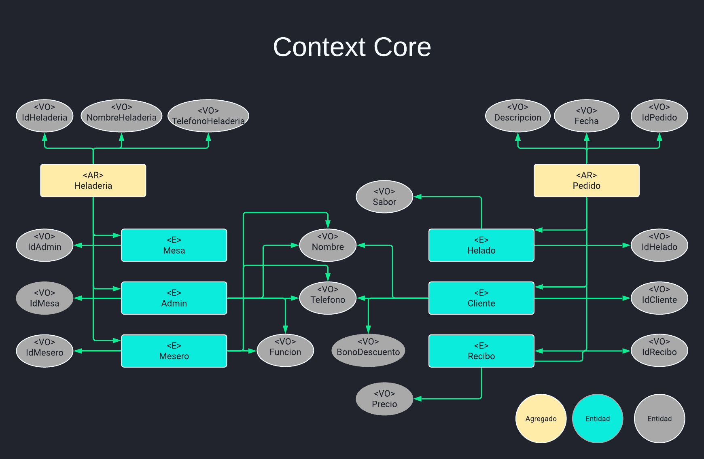
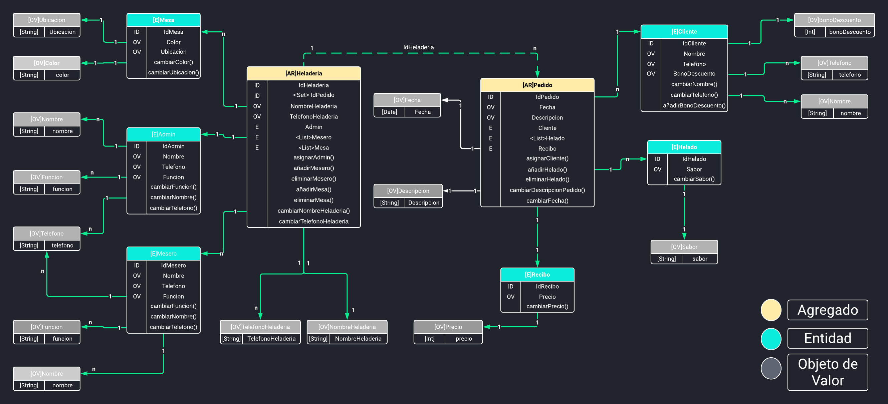

# RetoDDD

# Sofka Domain-Driven Design
Sofka introduce una librería a la comunidad open source para diseñar aplicaciones orientadas al dominio. Esta librería proporciona abstracciones que permiten adoptar el concepto de forma correcta, el estilo que se propone es totalmente discutible para ser mejorado, se espera que al momento de aplicar esta librería se tenga claro los conceptos tácticos de DDD.

# ¿Qué es DDD?
DDD (Domain-Driven Desing) es un método de diseño para descubrir el negocio de dominio de forma clara, apoyado de patrones de diseño y estilos de arquitectura centrados en el dominio.

# ¿Por qué DDD?
DDD es necesario cuando hablamos de modelamiento del negocio para grandes organizaciones, con el objetivo de diseñar software al rededor del dominio y no en solucionar un problema en particular. Ahora bien DDD no se aplica bien para el caso de un CRUD, dado que no estaría orientado al dominio organizacional, sino a resolver un problema en particular.

# ¿Qué resuelve la librería?
Desde el punto de vista táctico, se requiere aplicar algunos conceptos fundamentales, para poder aplicar DDD. Todo esos conceptos se tiene en la librería para interfaces o abstracciones, y además de proporcional algunos patrones de diseño que se adaptan a estilos de arquitecturas deferentes.

# Use Case/Problem
Con base al conocimiento adquirido sobre DDD poner en evidencia el conocimiento y dominio adquirido de esta temática, para ello realizaremos lo siguiente:

Se debe definir un problema cualquiera sobre el cual se planteara un Modelo de Dominio.
De manera individual se dará respuesta a la solución planteada expresada en el Modelo de Dominio y la librería de DDD.

Se deben tener en cuenta la siguientes directrices.

Se debe tener mínimo 2 agregado como mínimo
Se debe tener mínimo 3 entidades como mínimo por cada agregado.
Se debe tener mínimo 12 objetos de valor como mínimo
Se debe tener mínimo 12 comportamientos con sus respectivos eventos de dominio y/o comandos
Se debe tener mínimo 10 casos de uso disparados por comandos
Se debe tener mínimo 2 casos de uso disparados por eventos

